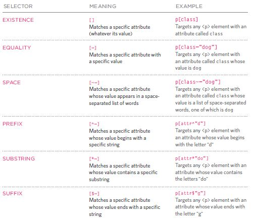

# HTML Images; CSS Color & Text

## HTML Images
It is good
practice to create a folder for all of the images
the site uses.

to insert an image to your website, use ``

- src: the source of the image
- alt: appears only when the image does not load 
- title: appears when you hover on the image 

edit the image resolution before using it in the websiteWeb images should be saved at a resolution of 72 ppi.
Also the images should be saved at the same width and height that you
want them to appear on the page.


## CSS Color & Text
CSS is an abbreviation of Cascading Style Sheet, it is a scripting language used to give a style to the html elements and make the web page more readable and adds beauty to it.

#### to change the color of the text
```css
color:blue;
```
#### to change the color of the background
```css
background-color:red;
```
#### Types of colors
```css
color: rgb(0,0,0);
color: rgba(0,0,0,0.5);
/*the last vlaue is the opacity and must be between 0 and 1*/
```
```css
/*hexadecimal*/
color: #f045c8;
```
```css
/*hsl*/
color: hsl(0,0%,78%);
color: hsla(0,100%,100%,0.5)

To change the text type we use `font-family properity`:
```css
p {
font-family: Arial, Verdana, sans-serif;}
```

to change text size use `font-size`:
-   Pixels
-   Percentages of the default size (16px)
-   Ems change the size of text relative to the size of the text in the parent element.

also there is`font-weight: /*normal or bold*/` and`text-transform: uppercase;` and `text-transform: lowercase;`

**Attribute Selectors**
These allow you to create rules that apply to
elements that have an attribute with a specific value.
