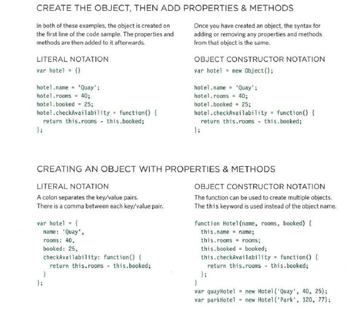

# HTML Tables; JS Constructor Functions

## HTML Tables
To oconstruct a table in HTML
```html
<table>
//Table Headings
<th>info</th>
<tr> //table row
<td>name</td> //table data
<td>ahmad</td>
<td>ibrahim</td>
</tr>
<tr>
<td>age</td>
<td>31</td>
<td>28</td>
</tr>
<tr>
<td>football Club</td>
<td>Al Wehdat</td>
<td>Al Faisaly</td>
</tr>
</table>
```
<table>
<th>info</th>
<tr> 
<td>name</td> 
<td>ahmad</td>
<td>ibrahim</td>
</tr>
<tr>
<td>age</td>
<td>31</td>
<td>28</td>
</tr>
<tr>
<td>football Club</td>
<td>Al Wehdat</td>
<td>Al Faisaly</td>
</tr>
</table>

* use `colspan="2"`attribute to stretch across more than one column.
## JS Constructor Functions
### Creating objects using constructor notation

```javascript
var hotel = new Object();
hotel.name= 'Park';
hotel.rooms = 120;
hotel .booked = 77;
hotel .checkAvailability = function()
return this . rooms - this.booked;
} ;
```

```javascript
function Hotel (name, rooms, booked) {
this .name = name;
this.rooms = rooms;
this.booked = booked;
this.checkAvailability = function(){
return this.rooms - this.booked;
} ;
}
```



### There are three groups of built in object models:
-   Browser Object Model
-   Document Object Model
- Global Javascript Objects


## Domain Modeling
>article

***Summary***

Domain modeling is the process of creating a conceptual model for a specific problem. And a domain model that's articulated well can verify and validate your understanding of that problem.

Here's some tips to follow when building your own domain models.

1. When modeling a single entity that'll have many instances, build self-contained objects with the same attributes and behaviors.
2. Model its attributes with a constructor function that defines and initializes properties.
3. Model its behaviors with small methods that focus on doing one job well.
4. Create instances using the new keyword followed by a call to a constructor function.
5. Store the newly created object in a variable so you can access its properties and methods from outside.
6. Use the this variable within methods so you can access the object's properties and methods from inside.
