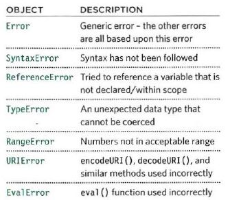

# JS Debugging

as a programmer  you will face errors defeanitly, everyone will make error and no one can make everything work from the first time.

Error objects can help you find where your mistakes are
and browsers have tools to help you read them.

Debugging Workflow

1. where is the problem?

2. what is the problem?

console methods:

1. `console.info()` :for general information
2. `console.warn()` :for warnings
3. `console.error ()` : to hold errors
4. `console.group ()`:to group a set of data `console.groupEnd ()`
5. `console.table ()` : tabe of data
6. `console.assert()` :  test if a condition is met, and write to the
console only if the expression evaluates to false.
 `console.assert(condition to be false, 'message');`

> THER IS CONDITIONAL BREAKPOINTS

handling exceptions
`javascript
try {
II Try to execute this code
}catch (exception) {
II If there is an exception, run this code
}finally {
II This always gets executed
}
`

***THROWING ERRORS***

throw new Error(\' message\') ;