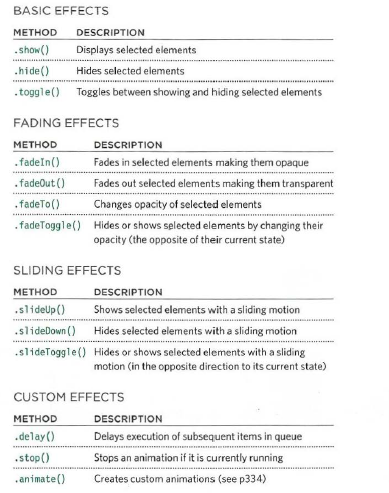

# jQuery, Events, and The DOM


## jQuery

jQuery is a file that you link to your project in order to write js code in a smipler way, jQuery power mainly comes with the DOM manipulation in which you can select elements , add event lsteners and add animation with a much simpler way.
```js
//to select an element
jQuery('<element in css format>')
//or
$('<element in css format>')
//for example
$('.class-two') 
```

If you want to use more than one jQuery method on the same selection of elements, you can list several methods at a time using dot notation to separate each one, as shown below.

```js
//example
$( 'li ').hide().delay(SOO).fadeln(1400);
```

The process of placing several
methods in the same selector is
referred to as chaining.

Each line starts with the dot
notation, and the semicolon
at the end of the statement
indicates that you have finished
working with this selection.

```js
$('li')
.hide()
.delay(500)
. fadeln(1400);

```

`.ready` method checks that the page is ready for the code to run
```js
$(document).ready(funcyion(){
    //code
});

//or use the short hand
$(function(){
    //code
});
```

popular jQuery methods and the corresponding js statement if i know them:

1. `.html()` == `innerHTML`
2. `text()` == `textContent`
3. `.replaceWith()` This method replaces every
element in a matched set with
new content. It also returns the
replaced elements.

4. `.before()`
This method inserts content
before the selected element(s) .

5. `.prepend()`
This method inserts content
inside the selected element(s),
after the opening tag.

6. `.after()`
This method inserts content
after the selected element (s).

7. `.append()`
This method inserts content
inside the selected element(s),
before the closing tag.

8. `.attr()`== `getAttribute` / `setAttribute`

9. `.removeAttr()`

10. `.addClass()`

11. `.removeClass()`


The `. css ()` method lets you retrieve
and set the values of CSS properties.

Also, **`each()`** 
Allows you to perform one or
more statements on each of
the items in the selection of
elements that is returned by a
selector - rather like a loop in
JavaScript.
It takes one parameter:
a function containing the
statements you want to run on
each element.

```js
//example

$( 'li').each(function() { 
let ids= this.id;
${this).append(' <em class="order">' +ids+ '</ em>');
));
```

### Sunnary Of jQuery Events




