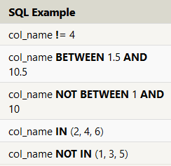
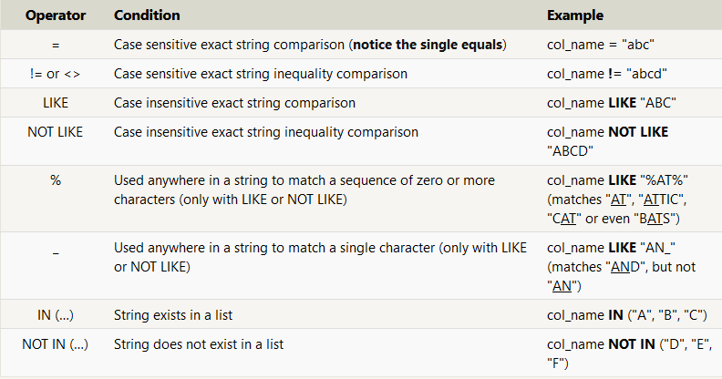

# SQL

Structured Query Language for  relational databases.

a relational database actually is. A relational database represents a collection of related (two-dimensional) tables.

###  SQL Queries List
A query in itself is just a statement which declares what data we are looking for, where to find it in the database, and optionally, how to transform it before it is returned:

1. SELECT \<columns\> FROM \<Table\>
```SQL
SELECT column, another_column, …
FROM mytable;
---------
SELECT * 
FROM mytable;
```   
2. WHERE \<condition\>
```SQL
SELECT column, another_column, …
FROM mytable
WHERE condition
    AND/OR another_condition
    AND/OR …;
```
**Opearators With conditions**

 

>All strings must be quoted so that the query parser can distinguish words in the string from SQL keywords. 


3. DISTINCT
```SQL

SELECT DISTINCT column, another_column, …
FROM mytable
WHERE condition(s);

```

4. ORDER BY clause with ***\>optional\<*** LIMIT and OFFSET
```SQL
SELECT column, another_column, …
FROM mytable
WHERE condition(s)
ORDER BY column ASC/DESC
LIMIT num_limit OFFSET num_offset;
```
>LIMIT will reduce the number of rows to return, and the optional OFFSET will specify where to begin counting the number rows from.